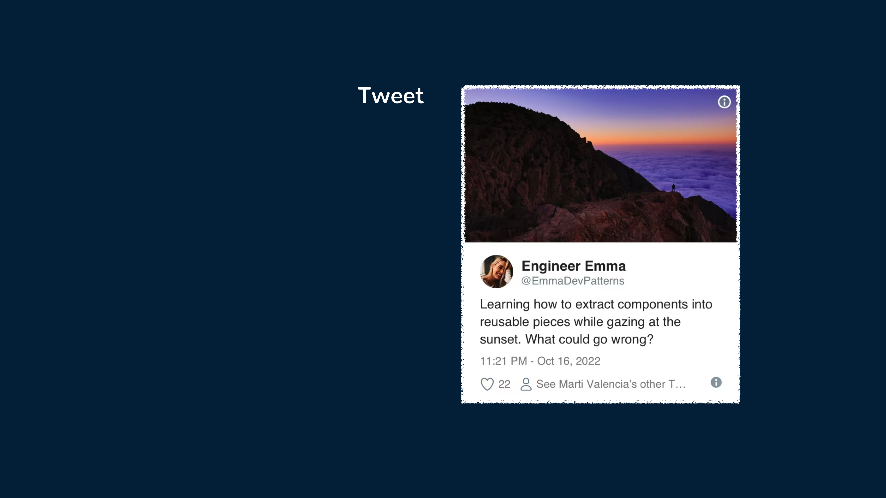
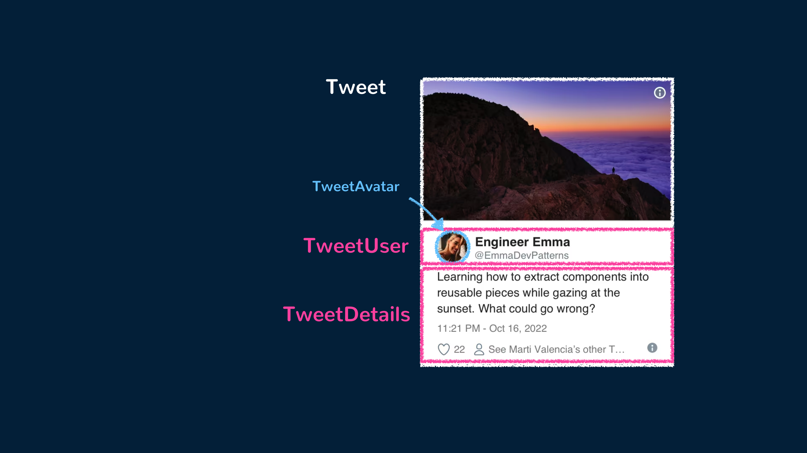
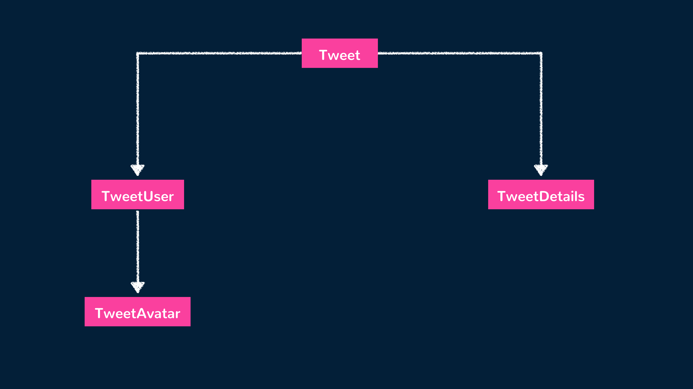
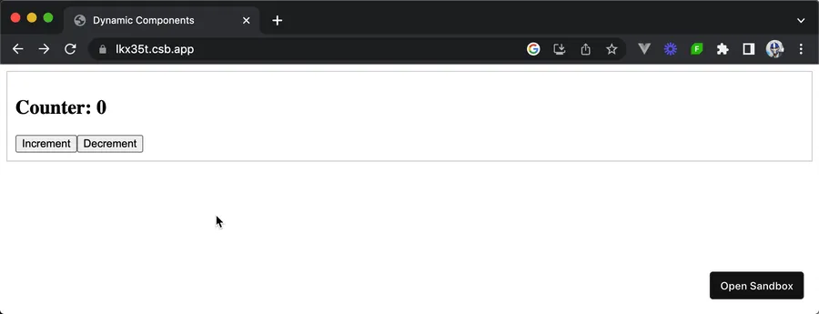

# 组件

> 原文链接：https://www.patterns.dev/vue/components
>
> 本文翻译：Rift

Vue 组件是组成 Vue 应用的基本单元，他允许我们将标记（HTML），逻辑（JS），样式（CSS）组合在一起。

在 Vue 应用运行时，需要理解显示在 UI 中的几乎每一个元素都是 Vue 组件的一部分。因为 Vue 应用通常都是由彼此嵌套的组件形成的一个层级结构。

可复用性和可维护性是驱使我们不断研究优秀的架构的主要原因之一。

为了更好地理解组件，我们来从头写一个出来。创建一个不需要构建（比如使用 Webpack 这些工具）的 Vue 组件最简单的办法是创建一个包含 Vue 指定字段的普通 JavaScript 对象。

```javascript
export default {
  props: ["name"],
  template: `<h1>Hello, my name is {{ name }}</h1>`,
};
```

这个组件定义一个 `props` 属性，接受一个叫 `name` 的参数。`Props` 是一种父组件向子组件传递数据的方式。

`template` 属性则是定义了组件的 HTML 模板。上面这个例子中有一个 `<h1>` 标签，标签中会展示文本 `"Hello, my name is "` 后面再跟着 props 中的 name 参数，借助 Vue 的双花括号语法渲染出来。


除了上面这种使用普通 JavaScript 对象创建组件的方式以外，最普遍的方式就是单文件组件（SFC）写法。单文件组件就是把 HTML，CSS 和 JS 都写在一个 `.vue` 文件里，就像这样：

```vue
<template>
  <h1>Hello, my name is {{ name }}</h1>
</template>

<script setup>
const { name } = defineProps(["name"]);
</script>
```

> 注意：
> Vue 的单文件组件是需要借助类似于 Vite 这类构建工具的。这些工具可以把 `.vue` 文件编译为浏览器可以识别的 JavaScript 模块。

## 组件是基本构建单元

我们可以通过一个简单的练习来说明一下如果将组件拆分为更小的组件。思考一下下面这个 `Tweet` 组件：



这个组件可以像下面这样实现：

```vue
<template>
  <div class="Tweet">
    <image class="Tweet-image" :src="image.imageUrl" :alt="image.description" />
    <div class="User">
      <image class="Avatar" :src="author.avatarUrl" :alt="author.name" />
      <div class="User-name">{{ author.name }}</div>
    </div>
    <div class="Details">
      <div class="Tweet-text">{{ text }}</div>
      <div class="Tweet-date">{{ formatDate(date) }}</div>
      <!-- ... -->
    </div>
  </div>
</template>

<script setup>
// ...
</script>
```

上面这个组件由于其复杂性而难以调整，也很难再复用其中的各个部分。为了让这个组件更具有可组合性，我们可以把这个组件提取为几个子组件。



我们可以把 `Tweet` 组件当作父组件，其下包含 `TweetUser` 和 `TweetDetails` 两个子组件。`TweetUser` 组件会显示用户信息并且包含一个用来展示用户头像的 `TweetAvatar` 子组件。`TweetDetails` 组件会简单地展示推特的其他的信息，如推文内容和发布日期等。这棵组件树结构就像下面这样：



我们可以先创建 `TweetAvatar` 组件，其中包含一个头像图片元素。

```vue
<template>
  <image class="Avatar" :src="author.avatarUrl" :alt="author.name" />
</template>

<script setup>
// ...
</script>
```

创建一个 `TweetUser` 组件，渲染出 `TweetAvatar` 组件和一些相关的用户信息。

```vue
<template>
  <div class="User">
    <TweetAvatar />
    <div class="User-name">{{ author.name }}</div>
  </div>
</template>

<script setup>
import { TweetAvatar } from "./TweetAvatar.vue";
</script>
```

创建一个 `TweetDetails` 组件，渲染出推特的其他信息。

```vue
<template>
  <div class="Details">
    <div class="Tweet-text">{{ text }}</div>
    <div class="Tweet-date">{{ formatDate(date) }}</div>
    <!-- ... -->
  </div>
</template>

<script setup>
// ...
</script>
```

最后，最后我们可以使用新创建的几个组件简化 `Tweet` 父组件的模板内容。

```vue
<template>
  <div class="Tweet">
    <image class="Tweet-image" :src="image.imageUrl" :alt="image.description" />
    <TweetUser :author="author" />
    <TweetDetails :text="text" :date="date" />
  </div>
</template>

<script setup>
// ...
</script>
```

提取组件看上去是一个单调乏味的工作，但是在大型应用中这些可复用性搞得组件可以让编码变得很简单。考虑何时需要简化组件的重要标准是——如果 UI 中的某一个部分被多次使用，或者它足够复杂，那么它最好抽取成一个独立的组件。

## 响应式状态

响应式状态是一个基本概念，它让 Vue 组件可以动态响应更新用户界面。它让组件可以更新以反映其中数据的变化。

在 Vue 中，我们可以使用 `ref()` 方法（用于基础数据类型）和 `reactive()` 方法（用于复合数据类型）来定义一个响应式数据，让我们看看一个计数组件的简单例子。

```vue
<template>
  <div>
    <h2>Counter: {{ count }}</h2>
    <button @click="increment">Increment</button>
    <button @click="decrement">Decrement</button>
  </div>
</template>

<script setup>
import { ref } from "vue";

const count = ref(0);

const increment = () => {
  count.value++;
};

const decrement = () => {
  count.value--;
};
</script>
```

在上面这个示例中，我们定义了一个响应式的属性 `count` 并初始化为 0。模板中使用双花括号语法来展示 `count` 的当前值。

这个模板中还包含两个按钮：`"Increment"` 和 `"Decrement"`，并且通过 `@click` 指令绑定到对应的 `increment()` 和 `decrement()` 方法上。在这两个方法中，我们更改了 `count` 的值。**Vue 检测到变化自动更新了组件的渲染来展示新的值。**



Vue 组件中的响应式状态提供了一个管理和追踪数据变化无缝衔接的方式，让搭建一个可互动的动态的用户界面变得非常容易。

## 结论

这篇文章队组件的概念做了一个简单的介绍。在其他的文章和指南中，我们会深入研究一些普遍的重要的 Vue 和 Vue 组件的开发模式。包括但不限于：

· 使用 `<script setup>` 语法

- 创建组合式函数（Composables）来复用状态相关的逻辑
- 通过 provide/inject 来向多个组件传递数据
- 了解应用内的状态管理
- 使用动态组件来动态的在多组件之间切换
- 使用 JSX 来渲染组件模板
- ...
