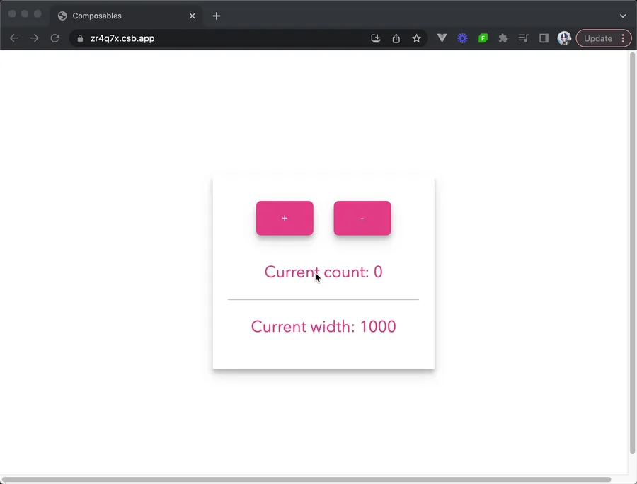
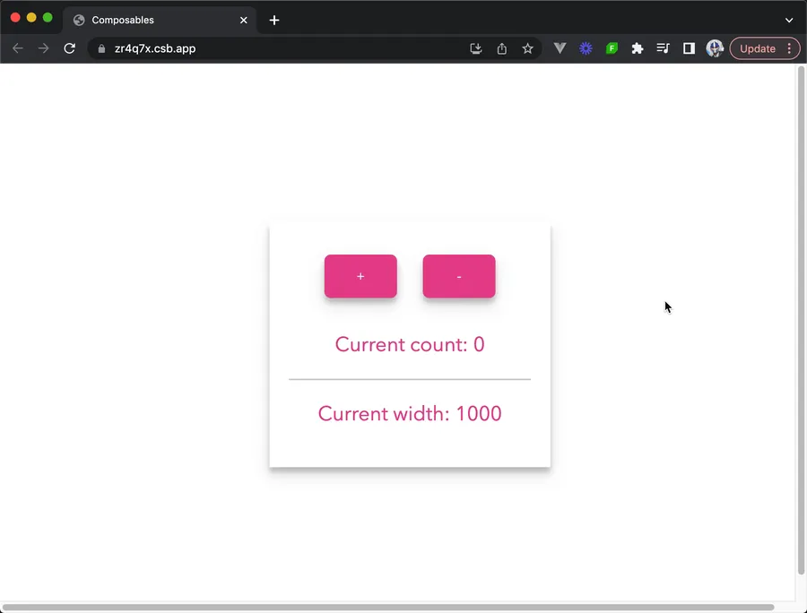
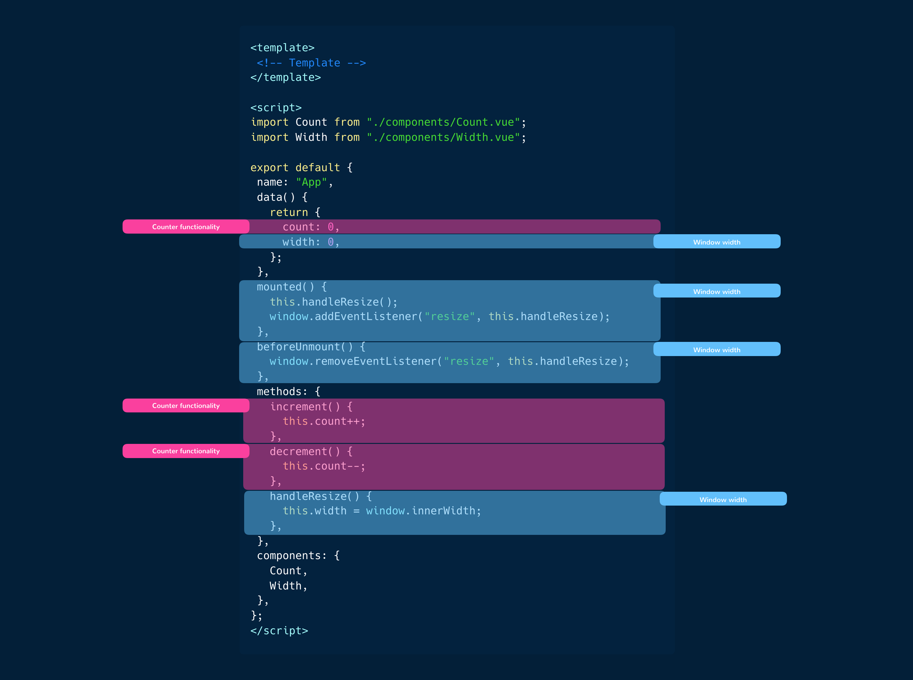
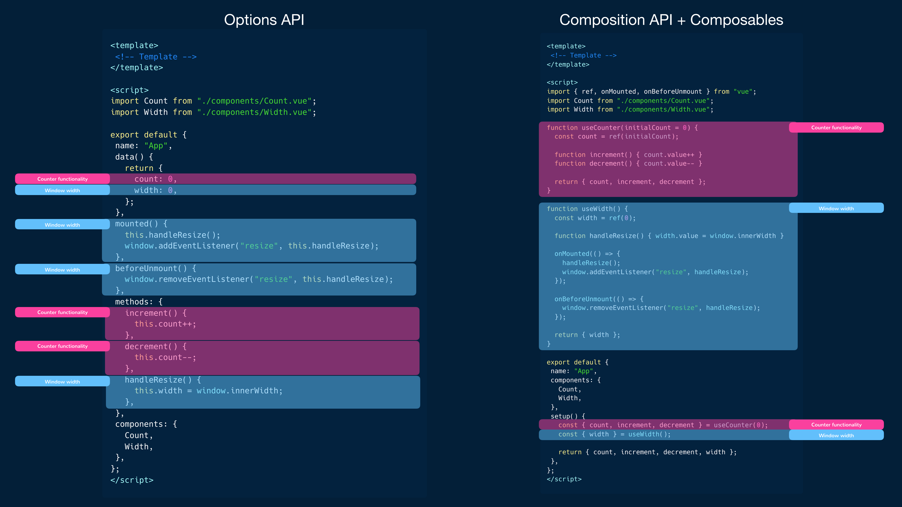

# 组合式函数

> 原文链接：https://www.patterns.dev/vue/composables
>
> 本文翻译：Rift

## 选项式 API

在 Vue 引入组合式 API 之前，开发者都需要使用选项式 API 来组织组件逻辑，包括响应式数据，生命周期方法，计算属性等等。选项式 API 可以让你使用特定的选项来定义这些，例如：

```html
<!-- Template -->

<script>
  export default {
    name: "MyComponent",
    props: {
      // props
    },
    data() {
      // data
    },
    computed: {
      // computed properties
    },
    watch: {
      // properties to watch
    },
    methods: {
      // methods
    },
    created() {
      // lifecyle methods like created
    },
    // ...
  };
</script>

<!-- Styles -->
```

虽然这种方法可以达到目的并且 Vue3 中也同样可以使用，但随着组件变得越来越大越来越复杂，管理和维护也变得越来越困难。使用特定选项定义组件逻辑也会让阅读理解代码变得困难，尤其是在处理一些特别复杂的组件时。提取和复用组件间的共用逻辑也将会变得很复杂。

看看下面这个例子，包含 `Count` 和 `Width` 两个独立子组件的名叫 `App` 的组件。

```html
<template>
  <div class="App">
    <Count :count="count" :increment="increment" :decrement="decrement" />
    <div id="divider" />
    <Width :width="width" />
  </div>
</template>

<script>
  import Count from "./components/Count.vue";
  import Width from "./components/Width.vue";

  export default {
    name: "App",
    data() {
      return {
        count: 0,
        width: 0,
      };
    },
    mounted() {
      this.handleResize();
      window.addEventListener("resize", this.handleResize);
    },
    beforeUnmount() {
      window.removeEventListener("resize", this.handleResize);
    },
    methods: {
      increment() {
        this.count++;
      },
      decrement() {
        this.count--;
      },
      handleResize() {
        this.width = window.innerWidth;
      },
    },
    components: {
      Count,
      Width,
    },
  };
</script>
```

这段代码是一个命名为 `App` 的单文件组件。

`<template>` 部分定义了组件的 HTML。这个例子中，包含一个 `<div>` 元素，类名为“App”，包含了两个子组件，`<Count>` 和 `<Width>`。这两个子组件都使用了 Vue 的响应式绑定语法传递了特定的属性参数（`:count`， `:increment`， `:decrement`， 和 `:width`）。

`<script>` 部分包含组建的 JavaScript 代码。开头分别从各自的文件引入了 `Count` 和 `Width` 两个组件。使用 `export default` 声明导出了组件定义。组件定义中有：

- `data` 方法返回了一个包含组件初始数据的对象，将 `count` 和 `width` 两个属性初始化为 0。
- `mounted()` 生命周期钩子可以在组件被挂载在 DOM 上后执行一段代码。在这个例子中，它调用了 `handleResize()` 方法，监听了窗口尺寸变化事件。
- `beforeUnmount()` 生命周期钩子可以在组件被解除挂载并销毁之前执行一段代码。这里它解除了对窗口尺寸变化事件的监听。
- `methods` 对象包含了组件的方法。这里定义了 `increment()`，`decrement()`， 和 `handleResize()` 三个方法来基于某些事件和行为来操控 count 和 width 两个数据属性。

应用运行时，count 的当前值和窗口内宽被实时的的展示出来了。用户可以通过在 `<Count>` 组件中使用按钮来增加和减少 count 的值与该组件进行交互。



同样的，width 的值也会在窗口宽度变化时更新。



`App.vue` 单文件组件的结构可视化如下:



即使这个组件不大，内部的逻辑也是完全纠缠在一起的。部分专门用于计数器的功能，而另外一些与宽度逻辑相关。随着组件越来越大，组织和定位逻辑也会变得越来越复杂。

为了应对这些问题，Vue 团队在 Vue3 中引入了组合式 API。

## 组合式 API

组合式 API 可以看作是**提供了代表 Vue 核心功能的独立函数的 API**。这些函数主要在一个单独的 `setup()` 选项中使用，以作为使用组合式 API 的入口。

```html
<!-- Template -->

<script>
  export default {
    name: "MyComponent",
    setup() {
      // the setup function
    },
  };
</script>

<!-- Styles -->
```

`setup()` 方法在组件创建之前以及组件的 props 参数可以获取到的时候被调用。

在组合式 API 中，我们可以引入这些独立的函数来帮助我们在组件中使用 Vue 的核心功能。我们可以使用组合式 API 的语法来重写上面这个计数和宽度的示例。

```html
<template>
  <div class="App">
    <Count :count="count" :increment="increment" :decrement="decrement" />
    <div id="divider" />
    <Width :width="width" />
  </div>
</template>

<script>
  import { ref, onMounted, onBeforeUnmount } from "vue";
  import Count from "./components/Count.vue";
  import Width from "./components/Width.vue";

  export default {
    name: "App",
    setup() {
      const count = ref(0);
      const width = ref(0);

      const increment = () => {
        count.value++;
      };

      const decrement = () => {
        count.value--;
      };

      const handleResize = () => {
        width.value = window.innerWidth;
      };

      onMounted(() => {
        handleResize();
        window.addEventListener("resize", handleResize);
      });

      onBeforeUnmount(() => {
        window.removeEventListener("resize", handleResize);
      });

      return {
        count,
        width,
        increment,
        decrement,
      };
    },
    components: {
      Count,
      Width,
    },
  };
</script>
```

组件的 `<template>` 部分没有变化，但是 `<script>` 部分我们现在是使用了组合式 API 的 setup() 方法。

在 setup() 方法中，我们：

- 使用 `ref()` 方法定义了 `count` 和 `width` 两个响应式变量 —— 这个方法接受一个基础数据类型（如 string，number 等）并返回一个响应式的/可变的对象。
- 定义了 `increment()`，`decrement()`， 和 `handleResize()` 三个方法。这些方法和之前选项式 API 例子中的相同。
- 使用 `onMounted()` 生命周期方法来调用 `handleResize()` 方法，来在组件被挂载之后监听窗口大小变化。同样地，我们使用 `onBeforeUnmount()` 生命周期方法来在组件被解除挂载之前解除对窗口大小变化的监听。
- 响应式变量在 `setup()` 方法中定义并返回出来，来让组件模板可以拿到这些值。

## 组合式函数

在先前的例子中，可能会有人想知道 `setup()` 到底有什么优势，毕竟他看起来就是把所有组件选项都放在一个方法中声明。

其中一个优势是**提取和复用组件间共用逻辑的能力**。这是因为我们可以很简单地使用 Vue 的全局可用的组合式函数声明一些我们自己的方法，并且可以轻松地在多个组件中使用这些方法实现相同的结果。

让我通过创建组合式函数进一步扩展之前的计数器和宽度示例，封装共用的逻辑以便在组件间复用。

首先，我们创建一个组合式函数叫做 `useCounter` ，来封装计数器功能并返回 `count` 的当前值，一个 `increment()` 方法，一个 `decrement()` 方法。

> 习惯上组合式函数的明明一般以 "use" 开头

```javascript
import { ref } from "vue";

export function useCounter(initialCount = 0) {
  const count = ref(initialCount);

  function increment() {
    count.value++;
  }

  function decrement() {
    count.value--;
  }

  return {
    count,
    increment,
    decrement,
  };
}
```

同样地，我们也可以创建一个叫 `useWidth()` 的组合式函数来封装宽度相关的逻辑。

```javascript
import { ref, onMounted, onBeforeUnmount } from "vue";

export function useWidth() {
  const width = ref(0);

  function handleResize() {
    width.value = window.innerWidth;
  }

  onMounted(() => {
    handleResize();
    window.addEventListener("resize", handleResize);
  });

  onBeforeUnmount(() => {
    window.removeEventListener("resize", handleResize);
  });

  return {
    width,
  };
}
```

在 `App` 组件中，我们可以使用这两个组合式函数来实现和之前相同的效果。

```javascript
<template>
  <div class="App">
    <Count :count="count" :increment="increment" :decrement="decrement" />
    <div id="divider" />
    <Width :width="width" />
  </div>
</template>

<script>
  import Count from "./components/Count.vue";
  import Width from "./components/Width.vue";
  import { useCounter } from "./composables/useCounter";
  import { useWidth } from "./composables/useWidth";

  export default {
    name: "App",
    components: {
      Count,
      Width,
    },
    setup() {
      const { count, increment, decrement } = useCounter(0);
      const { width } = useWidth();

      return {
        count,
        increment,
        decrement,
        width,
      };
    },
  };
</script>
```

通过这些改变，我们的应用有与之前的版本相同的功能，但在更具可组合性。

通过使用组合式 API 的组合式函数，我们可以将应用分成更小，更易复用的逻辑片段。

我们可以在做一次可视化，并且和之前的对比一下：



使用组合式函数可以更简单地将组件分隔成几个更小的片段。现在复用某些逻辑也变得更简单了，因为我们不再被限制地将代码写进特定的选项中。

借助这些组合式函数，我们可以更灵活地抽取和复用组件间地共用逻辑。关注点的分离可以让我们更关注于特定的功能，让我们的代码**更模块化更易于维护**。

通过将逻辑分成更小，更易复用的片段，我们使用组合式函数就可以不需要写重复代码地搭建我们的组件，整合必要的功能。这个方法提高了**代码的可复用性**，减少代码重复，不一致的风险。

另外，组合式 API 让组件逻辑有更好的**可读性，更易理解**。每个组合式函数都会封装组件行为的一部分，来让这些更易理解和测试。随着代码变得更加结构化和组织化，它也可以让团队成员间的配合更容易。

最后，使用组合式 API 构建 Vue 应用可以实现更好的类型推断。由于组合 API 可以帮助我们使用变量和标准 JavaScript 函数来处理组件逻辑,使用类似 TypeScript 的静态类型系统构建大型 Vue 应用也会变得容易得多。
